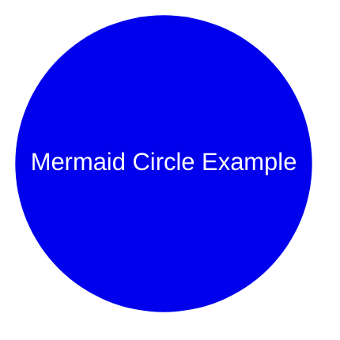

## 27-March-2023

### FLiPN-FLaNK Stack Weekly

Welcome to the eleventh newsletter of 2023. 

Tim Spann @PaaSDev

## PODCAST

New podcast coming.

## CODE + COMMUNITY

Join my meetup group NJ/NYC/Philly/Virtual. 

[https://www.meetup.com/new-york-city-apache-pulsar-meetup/](https://www.meetup.com/new-york-city-apache-pulsar-meetup/
)

[https://www.meetup.com/futureofdata-princeton/](https://www.meetup.com/futureofdata-princeton/)

[https://www.meetup.com/futureofdata-sanfrancisco/events/292453316/](https://www.meetup.com/futureofdata-sanfrancisco/events/292453316/)

**This is Issue #76**

[https://github.com/tspannhw/FLiPStackWeekly](https://github.com/tspannhw/FLiPStackWeekly)

[https://www.linkedin.com/pulse/schedule-2023-tim-spann-/](https://www.linkedin.com/pulse/schedule-2023-tim-spann-/)

### Chip of the year

[https://www.nvidia.com/en-us/data-center/h100/](https://www.nvidia.com/en-us/data-center/h100/)

### NiFi 2.0 is coming

[https://cwiki.apache.org/confluence/plugins/servlet/mobile?contentId=184618365#content/view/184618365](https://cwiki.apache.org/confluence/plugins/servlet/mobile?contentId=184618365#content/view/184618365)

### Meetup

[http://www.meetup.com/futureofdata-princeton/](http://www.meetup.com/futureofdata-princeton/)

[https://www.meetup.com/phillyjug/events/291103971/](https://www.meetup.com/phillyjug/events/291103971/)

### Videos

[https://www.youtube.com/watch?v=4X5Yky3CT6I](https://www.youtube.com/watch?v=4X5Yky3CT6I)

[https://www.youtube.com/watch?v=0HlwpF7ua7g&ab_channel=Cloudera%2CInc.](https://www.youtube.com/watch?v=0HlwpF7ua7g&ab_channel=Cloudera%2CInc.)

[https://m.youtube.com/watch?v=B7741cdZX8I&feature=youtu.be#dialog](https://m.youtube.com/watch?v=B7741cdZX8I&feature=youtu.be#dialog)

[https://bit.ly/3FQO0vq](https://bit.ly/3FQO0vq)

### Articles

[https://medium.com/cloudera-inc/consuming-github-webhook-events-with-cloudera-flow-management-de0108478b6e](https://medium.com/cloudera-inc/consuming-github-webhook-events-with-cloudera-flow-management-de0108478b6e)

[https://www.infoq.com/news/2023/03/dapr-version-one-ten-released/](https://www.infoq.com/news/2023/03/dapr-version-one-ten-released/)

[https://blog.cloudera.com/educating-chatgpt-on-data-lakehouse/](https://blog.cloudera.com/educating-chatgpt-on-data-lakehouse/)

[https://blog.cloudera.com/reliable-data-exchange-with-the-outbox-pattern-and-cloudera-dim/](https://blog.cloudera.com/reliable-data-exchange-with-the-outbox-pattern-and-cloudera-dim/)

[https://blog.cloudera.com/materialized-views-in-sql-stream-builder/](https://blog.cloudera.com/materialized-views-in-sql-stream-builder/)

[https://ai.facebook.com/blog/large-language-model-llama-meta-ai/](https://ai.facebook.com/blog/large-language-model-llama-meta-ai/)

[https://crfm.stanford.edu/2023/03/13/alpaca.html](https://crfm.stanford.edu/2023/03/13/alpaca.html)

[https://inside.java/2023/03/21/the-arrival-of-java-20/](https://inside.java/2023/03/21/the-arrival-of-java-20/)

[https://dev.37signals.com/bringing-our-apps-back-home/](https://dev.37signals.com/bringing-our-apps-back-home/)

[https://docs.opencv.org/4.x/dc/d70/pytorch_cls_tutorial_dnn_conversion.html](https://docs.opencv.org/4.x/dc/d70/pytorch_cls_tutorial_dnn_conversion.html)

[https://gcn.com/data-analytics/2014/12/nsa-releases-open-source-tool-for-high-volume-data-flows/297278/](https://gcn.com/data-analytics/2014/12/nsa-releases-open-source-tool-for-high-volume-data-flows/297278/)

[https://lilianweng.github.io/posts/2023-03-15-prompt-engineering/](https://lilianweng.github.io/posts/2023-03-15-prompt-engineering/)

[https://podman-desktop.io/blog/5-things-to-know-for-a-docker-user](https://podman-desktop.io/blog/5-things-to-know-for-a-docker-user)

[https://www.infoq.com/news/2023/03/mountpoint-amazon-s3/](https://www.infoq.com/news/2023/03/mountpoint-amazon-s3/)

### Recent Talks

Philly Jug - King of Prussia

[https://www.slideshare.net/bunkertor/phillyjug-getting-started-with-realtime-cloud-native-streaming-with-java](https://www.slideshare.net/bunkertor/phillyjug-getting-started-with-realtime-cloud-native-streaming-with-java)

Trenton Computer Festival Pro
[https://www.slideshare.net/bunkertor/itpc-building-modern-data-streaming-apps](https://www.slideshare.net/bunkertor/itpc-building-modern-data-streaming-apps)

[https://www.youtube.com/watch?v=iT60STl-Wuk&list=PLIJGKvnQWB-u0SPXIwozegOWCG2V85WGe&index=12](https://www.youtube.com/watch?v=iT60STl-Wuk&list=PLIJGKvnQWB-u0SPXIwozegOWCG2V85WGe&index=12)

### Hello Bard

### Events

March 30, 2023: NiFi Meetup - Virtual
[https://www.meetup.com/cloudera-brasil-meetup/events/291828145/](https://www.meetup.com/cloudera-brasil-meetup/events/291828145/)

March 31, 2023:  Warsaw IT - Virtual / Hybrid
[https://warszawskiedniinformatyki.pl/en/](https://warszawskiedniinformatyki.pl/en/)

April 4-6, 2023: DevNexus: Atlanta, GA. In-Person.
[https://devnexus.com/](https://devnexus.com/)

April 24-26, 2023: Real-Time Analytics Summit:  San Francisco, CA. In-Person.
[https://rtasummit.com/](https://rtasummit.com/)

April 25, 2023:   Future of Data Meetup:   San Francisco, CA. In-Person.
[https://www.meetup.com/futureofdata-princeton/](https://www.meetup.com/futureofdata-princeton/)
[https://www.meetup.com/futureofdata-sanfrancisco/events/292453316/](https://www.meetup.com/futureofdata-sanfrancisco/events/292453316/)

May 9, 2023:   Garden State Java User Group.   In-Person.   New Jersey
[https://gsjug.org/](https://gsjug.org/)

May 10-12, 2023:  Open Source Summit North America.   Virtual
[https://events.linuxfoundation.org/open-source-summit-north-america/](https://events.linuxfoundation.org/open-source-summit-north-america/)

Cloudera Events
[https://www.cloudera.com/about/events.html](https://www.cloudera.com/about/events.html)

More Events:
[https://www.linkedin.com/pulse/schedule-2023-tim-spann-/](https://www.linkedin.com/pulse/schedule-2023-tim-spann-/)

### Code

[https://repository.cloudera.com/artifactory/repo/org/apache/nifi/](https://repository.cloudera.com/artifactory/repo/org/apache/nifi/)

### Documents

[https://docs.cloudera.com/cem/latest/using-asset-push-command/topics/cem-updating-agent-capability-asset-push.html](https://docs.cloudera.com/cem/latest/using-asset-push-command/topics/cem-updating-agent-capability-asset-push.html)

### Research Projects

[https://www.mdpi.com/2304-6732/10/2/210](https://www.mdpi.com/2304-6732/10/2/210)

### Tools

[https://altstore.io/](https://altstore.io/)

[https://github.com/npiv/chatblade](https://github.com/npiv/chatblade)

[https://github.com/maciejwalkowiak/spring-boot-startup-report](https://github.com/maciejwalkowiak/spring-boot-startup-report)

[https://github.com/maciejwalkowiak/wiremock-spring-boot](https://github.com/maciejwalkowiak/wiremock-spring-boot)

[https://github.com/ChenyangQiQi/FateZero](https://github.com/ChenyangQiQi/FateZero)

[https://github.com/tatsu-lab/stanford_alpaca#data-generation-process](https://github.com/tatsu-lab/stanford_alpaca#data-generation-process)

[https://mermaid.live/edit](https://mermaid.live/edit)

[https://mermaid.js.org/syntax/examples.html](https://mermaid.js.org/syntax/examples.html)

[https://nicegui.io/#features](https://nicegui.io/#features)

[https://github.blog/2022-02-14-include-diagrams-markdown-files-mermaid/](https://github.blog/2022-02-14-include-diagrams-markdown-files-mermaid/)

[https://gist.github.com/ferencerdei/a3c57853fa29b5c690ba3c2ea51d5154](https://gist.github.com/ferencerdei/a3c57853fa29b5c690ba3c2ea51d5154)

[https://microsoft.github.io/ClimaX/](https://microsoft.github.io/ClimaX/)

[https://mail.openjdk.org/pipermail/jdk-dev/2023-March/007517.html](https://mail.openjdk.org/pipermail/jdk-dev/2023-March/007517.html)

[https://dagster.io/blog/fake-stars](https://dagster.io/blog/fake-stars)

[https://github.com/fauxpilot/fauxpilot](https://github.com/fauxpilot/fauxpilot)

[https://www.catscloudsandclusters.com/](https://www.catscloudsandclusters.com/)

[https://docs.openvino.ai/latest/openvino_docs_OV_UG_Samples_Overview.html](https://docs.openvino.ai/latest/openvino_docs_OV_UG_Samples_Overview.html)

[https://docs.opencv.org/4.x/dc/d70/pytorch_cls_tutorial_dnn_conversion.html](https://docs.opencv.org/4.x/dc/d70/pytorch_cls_tutorial_dnn_conversion.html)

[https://bard.google.com/](https://bard.google.com/)

[https://github.com/mrdbourke/pytorch-apple-silicon](https://github.com/mrdbourke/pytorch-apple-silicon)

[https://www.mrdbourke.com/setup-apple-m1-pro-and-m1-max-for-machine-learning-and-data-science/](https://www.mrdbourke.com/setup-apple-m1-pro-and-m1-max-for-machine-learning-and-data-science/)

[https://github.com/GerevAI/gerev](https://github.com/GerevAI/gerev)

[https://www.sqltranslate.app/](https://www.sqltranslate.app/)

[https://github.com/pycob/pyvibe](https://github.com/pycob/pyvibe)

[https://github.com/openai/evals](https://github.com/openai/evals)

[https://viper.cs.columbia.edu/](https://viper.cs.columbia.edu/)

[https://github.com/ws-kj/Orphic](https://github.com/ws-kj/Orphic)

[https://github.com/whoiskatrin/sql-translator](https://github.com/whoiskatrin/sql-translator)

[https://huggingface.co/spaces/adt/models-table](https://huggingface.co/spaces/adt/models-table)

[https://github.com/BlinkDL/RWKV-LM](https://github.com/BlinkDL/RWKV-LM)

[https://github.com/getcursor/cursor](https://github.com/getcursor/cursor)

[https://github.com/apple/ml-ane-transformers](https://github.com/apple/ml-ane-transformers)

[https://github.com/features/packages#pricing](https://github.com/features/packages#pricing)

[https://app.decktopus.com/sign-up](https://app.decktopus.com/sign-up)

[https://github.com/rajagurunath/lakehouse-sharing](https://github.com/rajagurunath/lakehouse-sharing)

[https://github.com/ozmartian/vidcutter](https://github.com/ozmartian/vidcutter)

[https://www.openshot.org/](https://www.openshot.org/)

[https://eventmesh.apache.org/docs/introduction](https://eventmesh.apache.org/docs/introduction)

[https://github.com/fafrd/aquarium](https://github.com/fafrd/aquarium)

[https://cloudevents.io/](https://cloudevents.io/)

[https://nacos.io/en-us/](https://nacos.io/en-us/)

[https://serverlessworkflow.io/](https://serverlessworkflow.io/)

[https://www.reddit.com/r/Python/comments/yu4ynu/pytemplate_oneclick_extensive_github_actions/](https://www.reddit.com/r/Python/comments/yu4ynu/pytemplate_oneclick_extensive_github_actions/)

[https://medium.com/cloudera-inc/consuming-rss-feeds-from-flink-sql-eaf33c1a5a23](https://medium.com/cloudera-inc/consuming-rss-feeds-from-flink-sql-eaf33c1a5a23)

&copy; 2023 Tim Spann
